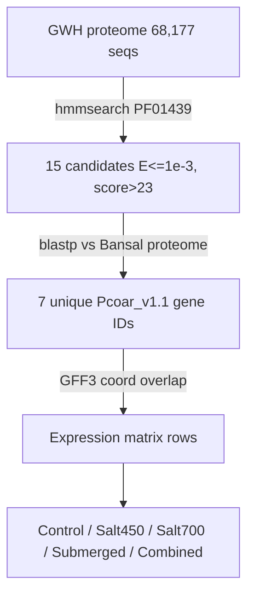

# *O. coarctata* Metallothionein Homolog & Expression Pipeline

> [!abstract] Scope
> Three stages: domain search → cross-assembly homology mapping → expression profiling under salt/submergence stress.
> Naming convention: `a2`/`A2` prefixes apply throughout. Protocol followed: [[01_homolog_oc_homolog_finder_protocol]].



---

## 1. Domain Search (HMMER)

Searched the candidate proteome for the metallothionein Pfam domain ([[PF01439]]) using `hmmsearch`, then filtered hits by E-value and bit score to keep only high-confidence matches.

```bash
# search: proteome vs PF01439 HMM profile
hmmsearch --cpu 32 --tblout a2_PF01439_hits.tbl PF01439.hmm proteinocGWHCBHR00000000.faa > a2_PF01439_full.txt

# filter: E-value <=1e-3 AND bit score >23, sort by score
awk '!/^#/ && $5+0 <= 1e-3 && $6+0 > 23 {print $1, $5, $6}' a2_PF01439_hits.tbl \
  | sort -k3,3gr > a2_PF01439_final_list.txt

# extract: matching sequences, pure awk (no seqtk available, no sudo)
awk 'BEGIN{while((getline id < "a2_PF01439_ids.txt")>0) want[id]=1}
/^>/{h=substr($1,2); keep=(h in want)} keep' \
  proteinocGWHCBHR00000000.faa > a2_PF01439_candidates.fasta
```

> [!success] Result
> `result/table/a2_PF01439_candidates.fasta` — **15 candidate MT-domain proteins** (from 68,177 total).

---

## 2. Homology Mapping to Reference Proteome (BLASTP)

Candidate IDs come from the GWH assembly (NGDC), not the Bansal et al. (2021) assembly used for expression data. Mapped candidates onto the Bansal Pcoar_v1.1 proteome by sequence similarity to get comparable gene IDs.

**Why this step is required:** the candidate proteome (GWH assembly) and the expression dataset (Bansal Pcoar_v1.1) are two independent genome assemblies/annotations *of the same species*. Cross-referencing by protein similarity is standard practice for linking gene sets across separate assemblies of one organism; it assumes — not confirms — that top blastp hits are the same locus or a close allelic/paralogous copy.

```bash
# build: blast db from Bansal proteome
makeblastdb -in a2_bansal2020protein_SCIS-JNU_Pcoar_v1.1_proteins.fasta -dbtype prot -out a2_pcoar_bansal_db

# search: 15 candidates vs Bansal proteome, best hit only
blastp -query a2_PF01439_candidates.fasta -db a2_pcoar_bansal_db \
  -outfmt "6 qseqid sseqid pident length evalue bitscore" \
  -evalue 1e-3 -max_target_seqs 1 -out a3_candidates_vs_bansal.tsv
```

> [!success] Result
> `data/filtered/Table_hits/a3_candidates_vs_bansal.tsv` — 14/15 candidates matched, collapsing to **7 unique Bansal gene IDs**. One candidate (GWHPCBHR005104) excluded — best hit e-value 0.021, below cutoff.

> [!warning] Note
> Several GWH candidates map to the same Bansal gene ID (e.g. 4 candidates → PC_38448) — likely split gene models or allelic variants in the tetraploid assembly, not independent genes.

---

## 3. Expression Profiling (Control vs Salt/Submergence)

Bansal gene IDs (`PC_xxxxx`) don't match the expression matrix's locus IDs (`XLOC_xxxxx`) directly. Mapped between them using genomic coordinates from the GFF3 against the matrix's `locus` column (scaffold + coordinate overlap).

Pulls transcript abundance for each confirmed gene under control, two salinity levels (Salt450, Salt700), submergence, and combined stress, from the RNA-seq dataset underlying Bansal et al. (2021).

```bash
# get: gene coordinates for the 7 confirmed IDs from GFF3
for id in PC_16059 PC_38448 PC_49963 PC_33031 PC_49317 PC_05154 PC_17111; do
  awk -v id="$id" '$3=="gene" && $9 ~ ("ID="id";") {print id, $1, $4, $5}' a2_SCIS-JNU_Pcoar_v1.1.gff3
done > a2_target_coords.tsv

# match: expression matrix rows by exact Gene ID (post coordinate-overlap validation)
python3 -c "
import openpyxl
wb = openpyxl.load_workbook('a2_Expression_Matrix_Ocoarctata.xlsx', read_only=True)
ws = wb['Expression_Matrix']
rows = list(ws.iter_rows(values_only=True))
header = rows[0]
gid_idx = header.index('Gene IDS')
targets = {'PC_16059','PC_38448','PC_49963','PC_33031','PC_49317','PC_05154','PC_17111'}
with open('a4_candidate_expression.tsv','w') as out:
    out.write('\t'.join(header)+'\n')
    for row in rows[1:]:
        if row[gid_idx] in targets:
            out.write('\t'.join(str(x) for x in row)+'\n')
"
```

> [!success] Result
> `result/table/a4_candidate_expression.tsv` — **7/7 genes resolved.**

---

## Master results table

Metallothionein (PF01439) candidate summary — *Oryza coarctata*. Expression values are from the [[Bansal 2020|Bansal et al. (2021)]] RNA-seq dataset.

| Bansal Gene ID | GWH Candidates (n)                         | Best % Identity | Best E-value | Genomic Locus (Pcoar_v1.1) | Control | Salt450 | Salt700 | Submerged | Salt450+Sub | Pattern                                   |
| -------------- | ------------------------------------------ | --------------- | ------------ | -------------------------- | ------- | ------- | ------- | --------- | ----------- | ----------------------------------------- |
| **PC_16059**   | GWHPCBHR004781, GWHPCBHR009782 (2)         | 100.0%          | 1.12e-46     | scaffold1429:90434–91247   | 73.96   | 83.94   | 124.93  | 107.56    | 87.19       | Salt-induced ↑                            |
| **PC_49963**   | GWHPCBHR019591–3 (3)                       | 100.0%          | 2.13e-145    | scaffold449:116774–119317  | 90.33   | 145.90  | 208.93  | 6.44      | 26.05       | Salt-induced ↑ / submergence-repressed ↓↓ |
| **PC_33031**   | GWHPCBHR063750 (1)                         | 98.6%           | 7.29e-46     | scaffold_107:168081–173452 | 878.88  | 1244.14 | 944.13  | 460.46    | 866.75      | High constitutive, Salt450 peak           |
| **PC_38448**   | GWHPCBHR005103, 065058, 066752, 066753 (4) | 100.0%          | 1.10e-49     | scaffold6725:5438–6346     | 2.35    | 0.79    | 0.72    | 1.95      | 0.45        | Salt-repressed ↓                          |
| **PC_05154**   | GWHPCBHR065057, 066751 (2)                 | 91.7%           | 5.22e-45     | scaffold2192:2814–3765     | 1.03    | 0.20    | 0.63    | 0.88      | 0.001       | Salt-repressed ↓                          |
| **PC_17111**   | GWHPCBHR065072 (1)                         | 100.0%          | 4.80e-50     | scaffold1803:79022–81323   | 2.98    | 1.00    | 0.42    | 2.55      | 2.49        | Salt-repressed ↓                          |
| **PC_49317**   | GWHPCBHR065056 (1)                         | 100.0%          | 1.18e-35     | scaffold481:82–1283        | 0.001   | 0.001   | 0.06    | 0.001     | 0.001       | Near detection floor — inconclusive       |

---

## Biological reading

Pattern-level only — **not statistically tested.**

- **PC_16059, PC_49963** — expression rises with increasing salt (both roughly 1.5–2.3× control at Salt700), consistent with the salt-inducible MT2 pattern reported across halophyte and glycophyte species. PC_49963 additionally drops sharply under submergence alone (6.4 vs. 90.3 control) — a stress-*specific* rather than general-stress response.
- **PC_33031** — highest baseline expression by far (~880 control), rises further under Salt450 then partially declines at Salt700/submergence — behaves like a dominant, constitutively-active isoform rather than a strictly stress-inducible one.
- **PC_17111, PC_05154, PC_38448** — low overall expression, mild decline under salt. Seen in some MT2 paralogs that are down-regulated rather than induced by salinity; not every family member responds in the same direction. Expression of *BnMT1-3* was down-regulated under salt stress while *BnMT4* increased strongly at the highest salt concentrations — within-family divergence in stress direction is normal, not anomalous ([NIH PMC4207811](https://www.ncbi.nlm.nih.gov/pmc/articles/PMC4207811/)).
- **PC_49317** — at or near the matrix's detection floor across every condition. Could be a pseudogene, a tissue/stage-specific gene not captured by the sampled tissue, or an annotation artifact — these cannot be distinguished from expression data alone.

---

## What can and cannot be claimed

**Did we find true homologs?** Two different claims need separating:

- **Domain-family membership — ✅ confirmed.** All 7 genes carry the PF01439 (Metallothio_2) domain signature via HMM match, and cross-assembly identity is 91.7–100% with e-values as low as 1e-145. These are genuine type-2 metallothionein family members, and the GWH↔Bansal matches are almost certainly the same genes viewed through two independent assembly efforts (*not* cross-species homologs — same species, two annotations).
- **Orthology to a characterized MT gene — ❌ not established.** No comparison was made against functionally characterized MTs from other species (OsMT2b, SbMT-2, SsMT2, PdMT2A). Without a phylogenetic tree or reciprocal-best-hit against a reference set, "true homolog of gene X" cannot be claimed — only "member of the type-2 MT family".

**Is it something new?** A genome-wide MT survey exists for the *Oryza* genus covering six species — *O. sativa* ssp. japonica/indica, *O. rufipogon*, *O. nivara*, *O. glumaepatula*, *O. barthii* (53 MT genes identified). **O. coarctata is absent from that survey.** So a systematic type-2 MT identification specific to this halophyte appears to be a gap this pipeline fills.

> [!caution] Novelty caveat
> Based on the searches run so far, not an exhaustive literature check. Confirm with a targeted search for "Oryza coarctata metallothionein" before stating novelty in a manuscript.

### Status summary

| Question | Status |
|---|---|
| Domain identity confirmed | ✅ HMM-validated |
| Same-species cross-assembly match | ✅ 91.7–100% identity |
| Orthology to named/characterized MT gene | ❌ not tested |
| Subclass (Cys-motif type within MT2) | ❌ not tested |
| Statistically validated stress-responsiveness | ❌ no replicates/DE test |
| Novel to *O. coarctata* specifically | ⚠️ likely, not confirmed exhaustively |

---

## Next steps

Computational, literature-precedented — no wet-lab steps.

- [ ] **Phylogenetic placement** — what subclade do these belong to relative to known plant MTs? Build a tree with characterized sequences (OsMT2b, SbMT-2, SsMT2, PdMT2A); same approach used in the *Oryza*-genus MT paper for clade assignment.
- [ ] **Cys-motif classification** — align candidate sequences, classify by C-X-C / C-C / C-X-X-C spacing; standard type-2 subclassification used in the cork oak and cassava MT papers.
- [ ] **Duplication check** — inspect GFF3 coordinates for tandem/segmental duplication. The *Oryza*-genus paper found MT genes clustered on chromosome 12 via duplication; worth checking whether the 4-candidates→1-locus (PC_38448) pattern reflects real tandem duplication rather than assembly splitting.
- [ ] **Promoter cis-element scan** — extract ~1–2 kb upstream via GFF3 coordinates, scan for ABRE/MYB/stress elements; same method applied to *BnMT1-4* promoters in the *Brassica napus* salt-stress paper.
- [ ] **Statistical DE testing** — raw RNA-seq reads are deposited under GEO accession GSE44913; reprocessing with DESeq2/edgeR would replace the current single-value comparison with statistically tested fold-changes.

---

> [!bug] Inference boundary
> - Values are single normalized expression measurements, **not replicate-tested differential expression** — visual trends are not statistically validated DEG calls.
> - Coordinate-overlap ID mapping assumes synteny between assemblies at these loci, **not independently confirmed**.
> - Values at 0.001 are the matrix's **detection floor**, not literal zero expression.
> - None of the "Next steps" has been run yet — this session established candidate identity and raw expression levels only. Claims of "salt-induced" or "novel" should stay qualified until phylogenetic placement and statistical testing are done.

---

## Citations

Bansal, J., Gupta, K., Rajkumar, M. S., Garg, R., & Jain, M. (2021). Draft genome and transcriptome analyses of halophyte rice *Oryza coarctata* provide resources for salinity and submergence stress response factors. *Physiologia Plantarum*, *173*(4), 1309–1322. https://doi.org/10.1111/ppl.13284

Cheng, M. (2021). Genome-wide identification and analysis of the metallothionein genes in *Oryza* genus. *International Journal of Molecular Sciences*, *22*(17), 9651. https://doi.org/10.3390/ijms22179651

Mierek-Adamska, A., Tylman-Mojżeszek, W., Pawełek, A., Kulasek, M., & Dąbrowska, G. B. (2025). The potential role of *Brassica napus* metallothioneins in salt stress and interactions with plant growth-promoting bacteria. *Genes*, *16*(2), 166. https://doi.org/10.3390/genes16020166

## Related

- [[01_homolog_oc_homolog_finder_protocol]] — the protocol this run followed
- [[Bansal 2020]] — source of the expression matrix
- [[PF01439]] · [[Pfam]] · [[HMMER]]
- [[Oryza coarctata data inventory]]
