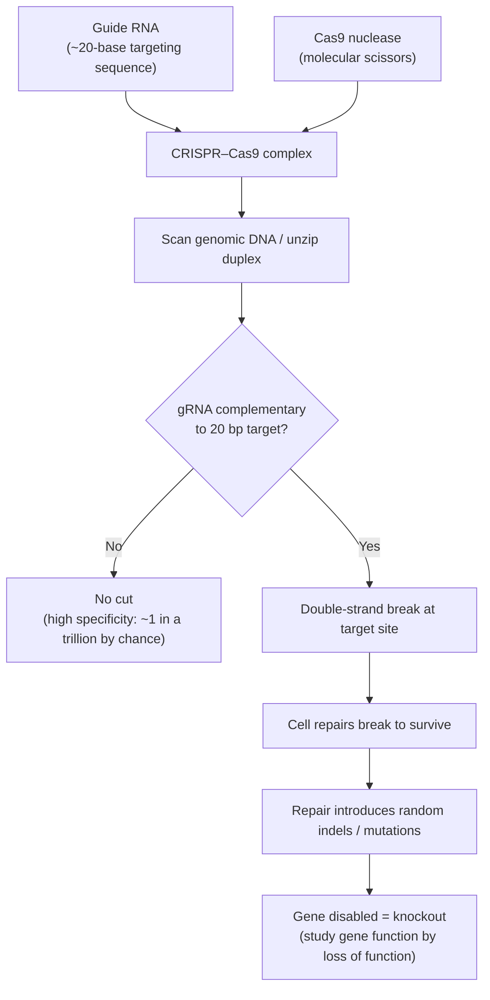

# CRISPR/Cas9 Knockout

Source: *"Knockout! A CRISPR/Cas Gene Targeting Lab Webinar"* — mini PCR bio ([video](https://www.youtube.com/watch?v=36-rlJly6yQ))

## Mechanism — how Cas9 edits a gene

```mermaid
flowchart TD
    gRNA["Guide RNA<br/>(~20-base targeting sequence)"] --> COMPLEX["CRISPR–Cas9 complex"]
    CAS9["Cas9 nuclease<br/>(molecular scissors)"] --> COMPLEX
    COMPLEX --> SCAN["Scan genomic DNA / unzip duplex"]
    SCAN --> MATCH{"gRNA complementary<br/>to 20 bp target?"}
    MATCH -- No --> NOCUT["No cut<br/>(high specificity: ~1 in a trillion by chance)"]
    MATCH -- Yes --> DSB["Double-strand break at target site"]
    DSB --> REPAIR["Cell repairs break to survive"]
    REPAIR --> INDEL["Repair introduces random indels / mutations"]
    INDEL --> KO["Gene disabled = knockout<br/>(study gene function by loss of function)"]
```

