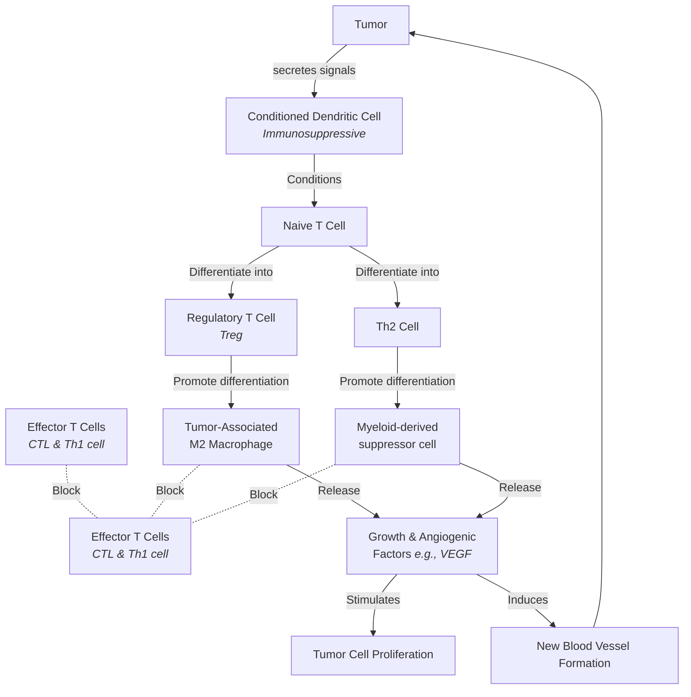

![[zm501]]

# Tumor Antigens

## Overview
- **Tumor antigens (Tumor Ag)** are presented with **class I MHC molecules** and induce a cell-mediated response by tumor-specific **CTLs**.
- The old distinction between **TAA** and **TSA** is **not accurate** — it doesn't cleanly explain how these antigens actually arise.

## Classical (Old) View
- **Chemical- and spontaneous-induced** tumor antigens → difficult to classify (highly variable/unique per tumor).
- **Virus-induced** tumor antigens → all tumors from the same virus share the same antigens.
- Presence of virus-specific tumor antigens is an indicator of **neoplastic transformation**.
  - e.g. **Burkitt's lymphoma → EBNA1** (Epstein-Barr virus)
  - e.g. **80% of invasive cervical cancers → HPV E6 and E7 proteins**
- Some antigens are present in **both tumor and normal cells**, just at different levels:
  - Normal cell → very low expression
  - Tumor cell → high expression

### Old Terminology
| Term | Meaning |
|---|---|
| **TSTA** | Tumor-Specific Tumor Antigen |
| **TATA** | Tumor-Associated Tumor Antigen |

- **TSA** — a genuinely new peptide, created **by mutation**
- **TAA** — a normal protein **expressed at the wrong time/place** (e.g., oncofetal or overexpressed antigens)

## Modern Classification — mnemonic **MOO-VOAC**
Based on **molecular structure and source** of the antigen:

1. **M** — Products of **M**utated Oncogenes and Tumor-Suppressor Genes
2. **O** — Products of **O**ther Mutated Genes
3. **O** — **O**verexpressed or Aberrantly Expressed Cellular Proteins
4. **V** — Tumor Antigens Produced by Oncogenic **V**iruses
5. **O** — **O**ncofetal Antigens
6. **A** — **A**ltered Cell-Surface Glycolipids and Glycoproteins
7. **C** — **C**ell Type-Specific Differentiation Antigens

### Genes involved (categories 1–3 above, in more detail)
1. **Oncogenes**
2. **Tumor-suppressor genes** (anti-oncogenes) — encode proteins that inhibit excessive cell proliferation
3. **Genes involved in programmed cell death (apoptosis)** — encode proteins that induce or block apoptosis
   - **Pro-apoptotic genes** → act like tumor suppressors
   - **Anti-apoptotic genes** → act like oncogenes

> Cancer relates to normal cells through these **3 categories** of genes.

### Example — overexpression (category 3)
From an oncogene product:
- **EGF** → ~100× higher in tumor
- **Melanotransferrin (p97)**:
  - Normal ≤ 8,000
  - Tumor ≈ 50,000–100,000

## Mechanism of Generating TSAs & TAAs
Starting from a normal cell (self-peptide + Class I MHC, no immune response):

| Pathway                                           | Result                               | Antigen type |
| ------------------------------------------------- | ------------------------------------ | ------------ |
| **Mutation** generates a new peptide              | Altered self-peptide on Class I MHC  | **TSTA**     |
| **Inappropriate expression** of an embryonic gene | Oncofetal peptide presented          | **TATA**     |
| **Overexpression** of a normal protein            | Excess normal self-peptide presented | **TATA**     |

## Neoantigens
- The majority of tumor antigens that elicit **protective immune responses** are **neoantigens produced by mutated genes** in different tumor cell clones.
- **Neoantigens** are unique, newly formed proteins/peptides that arise on the tumor cell surface due to genetic alterations (mutations).

**Normal vs. tumor cell presentation:**
- **Normal cell**: normal self-peptides displayed on MHC → no responding T cells (immune tolerance)
- **Tumor cell**: mutation-generated **neoepitope** → new TCR contact residue → triggers a T-cell response

## Tumor Antigens from Oncogenic Viruses
- A peptide from a protein encoded by an oncogenic virus is presented → elicits a T-cell response.
- Products of oncogenic viruses function as tumor antigens and elicit specific T-cell responses that may help **eradicate virus-induced tumors**.
- Examples:
  - **Epstein–Barr virus (EBV)** → B-cell lymphomas, nasopharyngeal carcinoma
  - **Human papillomavirus (HPV)** → carcinomas of the uterine cervix, oropharynx, and other sites
- In most DNA virus–induced tumors, virus-encoded protein antigens are found in the **nucleus, cytoplasm, or plasma membrane** of tumor cells.
- These endogenously synthesized viral proteins are processed and presented by **MHC molecules** on the tumor cell surface.

## Reference Table — Antigen Categories, Examples & Associated Cancers

**Tumor-Specific Antigens (TSAs) — Viral**
| Antigen(s) | Associated cancer |
|---|---|
| HPV: L1, E6, E7 | Cervical carcinoma |
| HBV: HBsAg | Hepatocellular carcinoma |
| SV40: Tag | Malignant pleural mesothelioma |

**Tumor-Associated Antigens (TAAs) — Overexpression**
| Antigen(s) | Associated cancer |
|---|---|
| MUC1 | Breast, ovarian |
| MUC16/CA-125 | Ovarian |
| HER-2/neu | Breast, melanoma, ovarian, gastric, pancreatic |
| MAGE | Melanoma |
| PSMA | Prostate |
| TPD52 | Prostate, breast, ovarian |

**TAAs — Differentiation-Stage Antigens**
| Antigen(s) | Associated cancer |
|---|---|
| CEA | Colon |
| Gp100 | Melanoma |
| AFP | Hepatocellular carcinoma |
| Tyrosinase | Melanoma |
| PSA | Prostate |
| PAP | Prostate |

## Diagrams (source slides)
![[Pasted Image 20260911145439_228.png]]
![[Pasted Image 20260911150738_761.png]]
![[Pasted Image 20260911152137_845.png]]
![[Pasted Image 20260911153227_128.png]]
![[Pasted Image 20260911153500_733.png]]
![[Pasted Image 20260911153651_187.png]]
![[Pasted Image 20260911153755_360.png]]

**The Core Concept**
Prior exposure to dead tumor cells acts like a vaccine, training the immune system to recognize tumor antigens and eliminate live cancer cells later.

---

