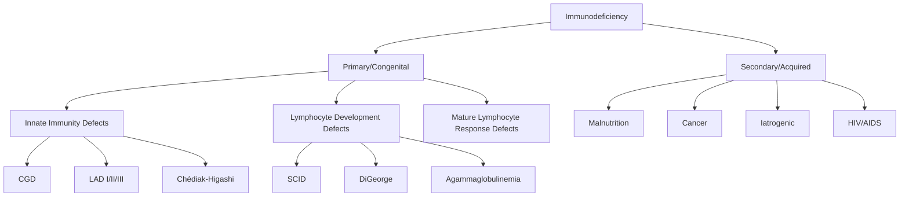
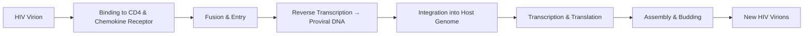
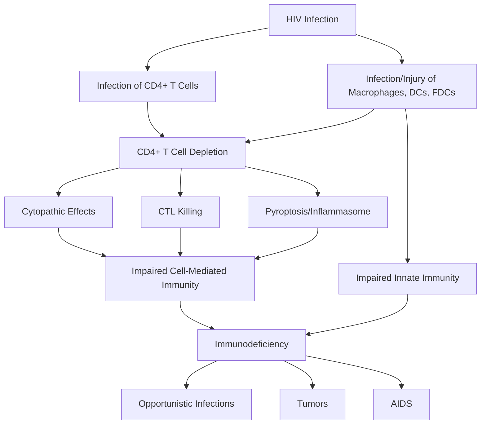
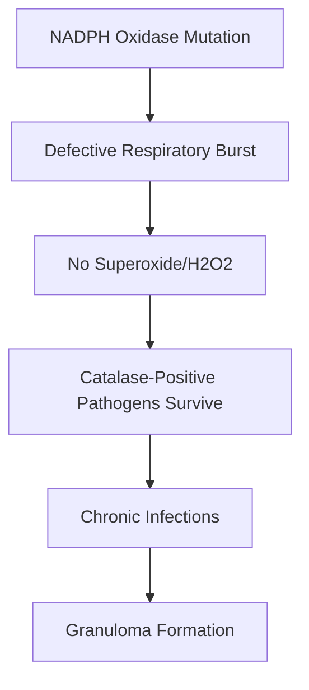
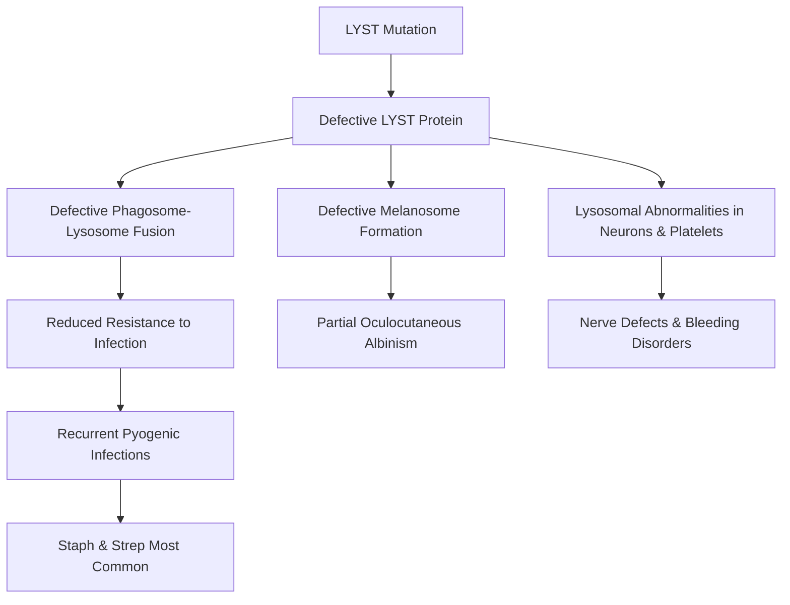
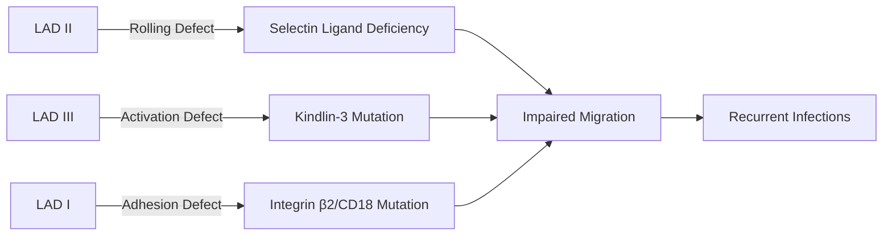
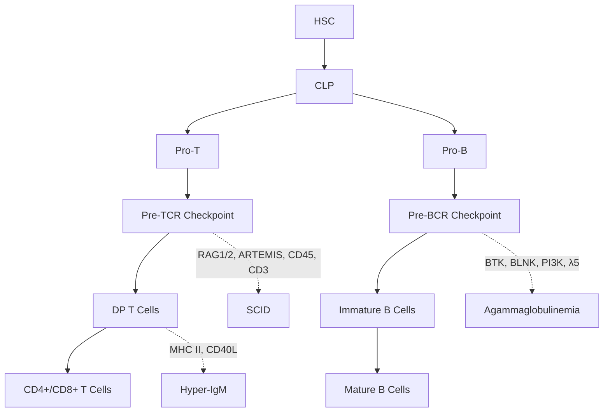
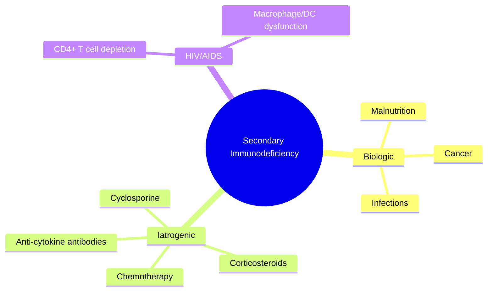

# BMB-507: Clinical Immunology and Immunodiagnostics – Complete Study Guide

## Immunodeficiency – Whole PDF Summary

---

## 1. INTRODUCTION TO IMMUNODEFICIENCY

### Definition

**Immunodeficiency** (immune deficiency) is a condition characterized by a **weakened or compromised immune system**. The immune system is a complex network of cells, tissues, and organs that defend the body against harmful pathogens (bacteria, viruses, fungi, other microorganisms). When the immune system is not functioning properly, the body becomes more susceptible to infections and may have difficulty mounting an effective defense.

### Classification

Defects in one or more components of the immune system can lead to serious and often fatal disorders, collectively called **immunodeficiency diseases**. These are broadly classified into two groups:

| Feature | Primary (Congenital) | Secondary (Acquired) |
|---------|---------------------|---------------------|
| **Cause** | Genetic defects | Not inherited; develop during life |
| **Onset** | Infancy/early childhood (sometimes later) | Any age |
| **Examples** | SCID, CGD, LAD, Chédiak-Higashi | HIV/AIDS, malnutrition, cancer, iatrogenic |
| **Frequency** | Rare | More common |

### General Features of Immunodeficiency

1. **Increased susceptibility to infection** – Principal consequence
2. **Increased susceptibility to certain cancers** – Many caused by oncogenic viruses (EBV, HPV)
3. **Increased incidence of autoimmunity** – Seen when there is incomplete loss of an immune population or function
4. **Heterogeneous** – May result from defects in lymphocyte development, activation, or effector mechanisms of innate and adaptive immunity

### TABLE 21.1 – Features of Immunodeficiencies Affecting T or B Lymphocytes

| Feature | B Cell Deficiency | T Cell Deficiency |
|---------|-------------------|-------------------|
| **Susceptibility to infection** | Pyogenic bacteria (otitis, pneumonia, meningitis, osteomyelitis), enteric bacteria and viruses, some parasites | *Pneumocystis jiroveci*, many viruses, atypical mycobacteria, fungi |
| **Serum Ig levels** | Reduced | Normal or reduced |
| **DTH reactions** | Normal | Reduced |
| **Lymphoid tissue morphology** | Absent/reduced follicles and germinal centers (B cell zones) | Normal follicles, may be reduced parafollicular cortical regions (T cell zones) |

---

## 2. PRIMARY (CONGENITAL) IMMUNODEFICIENCIES

### Overview

In different primary immunodeficiencies, the causative abnormality may be in:

```
                    PRIMARY IMMUNODEFICIENCY
                              │
         ┌────────────────────┼────────────────────┐
         │                    │                    │
         ▼                    ▼                    ▼
┌─────────────────┐ ┌─────────────────┐ ┌─────────────────┐
│ Components of   │ │ Different stages│ │ Responses of    │
│ Innate Immune   │ │ of Lymphocyte   │ │ Mature          │
│ System          │ │ Development     │ │ Lymphocytes to  │
│                 │ │                 │ │ Antigenic       │
│                 │ │                 │ │ Stimulation     │
└─────────────────┘ └─────────────────┘ └─────────────────┘
```

**Primary Immunodeficiency Disorders:**
- Diverse group of conditions
- Affect one or more elements of immune system
- ↑ Vulnerability to: Infection, Autoimmune manifestations, Cancer

---

## 3. DEFECTS IN INNATE IMMUNITY

### TABLE 21.2 – Congenital Disorders of Innate Immunity

| Disease | Functional Deficiencies | Mechanism of Defect |
|---------|------------------------|---------------------|
| **Chronic Granulomatous Disease (CGD)** | Defective production of reactive oxygen species (ROS) by phagocytes; recurrent intracellular bacterial and fungal infections | Mutation in genes encoding proteins of the phagocyte oxidase (phox) complex; phox-91 (cytochrome b558 α subunit) mutated in X-linked form |
| **Leukocyte Adhesion Deficiency Type 1 (LAD-I)** | Defective leukocyte adhesion to endothelial cells and migration into tissues; recurrent bacterial and fungal infections | Mutations in gene encoding the β chain (CD18) of β2 integrins |
| **Leukocyte Adhesion Deficiency Type 2 (LAD-II)** | Defective leukocyte rolling and migration into tissues; recurrent bacterial and fungal infections | Mutations in gene encoding GDP-fucose transporter-1, required for transport of fucose into Golgi and its incorporation into sialyl Lewis X |
| **Leukocyte Adhesion Deficiency Type 3 (LAD-III)** | Defective leukocyte adhesion and migration into tissues; defective chemokine-stimulated integrin activation | Mutations in gene encoding KINDLIN-3, a cytoskeletal protein linked to integrin activation |
| **Chédiak-Higashi Syndrome** | Defective vesicle fusion and lysosomal function in neutrophils, macrophages, dendritic cells, NK cells, cytotoxic T cells, and many other cell types; recurrent infections by pyogenic bacteria | Mutation in LYST leading to defect in secretory granule exocytosis and lysosomal function |

---

### 3.1 Chronic Granulomatous Disease (CGD)

**Definition:** Rare inherited disorder impairing immune system's ability to fight certain infections. Affects phagocytes, preventing them from effectively killing bacteria and fungi.

**Genetics:**
- ~2/3 cases: **X-linked recessive** – mutation in gene encoding **91-kD α subunit of cytochrome b558** (phox-91)
- Remainder: **Autosomal recessive** – mutations in other phox complex components

**Pathogenesis:**
```
NADPH Oxidase Mutation
         │
         ▼
Defective Respiratory Burst
         │
         ▼
No Superoxide (O₂⁻) / Hydrogen Peroxide (H₂O₂)
         │
         ▼
Catalase-Positive Pathogens Survive
         │
         ▼
Chronic Infections
         │
         ▼
Granuloma Formation (activated macrophages)
```

**Clinical Features:**
- Recurrent infections with intracellular fungi and bacteria (*Staphylococcus*, *Aspergillus*)
- Catalase-positive organisms are particularly troublesome (destroy H₂O₂)
- Invasive *Aspergillus* infection = leading cause of death
- Granulomas composed of activated macrophages

**Treatment:**
- **IFN-γ therapy** – enhances transcription of phox91 gene; stimulates superoxide production
- Restores superoxide to ~10% of normal → greatly improved resistance to infection
- Commonly used for X-linked CGD in the United States

**Phox Complex Components:**

| Subunit | Chromosome/Gene | Inheritance | Frequency |
|---------|----------------|-------------|-----------|
| gp91phox | Xp21.1/CYBB | XR | ~65% |
| p22phox | 16q24/CYBA | AR | <5% |
| p47phox | 7q11.23/NCF1 | AR | ~25% |
| p67phox | 1q25/NCF2 | AR | ~5% |

**Gene Descriptions:**
- **CYBB:** cytochrome b-245, beta chain (p91-phox); Xp21.1
- **CYBA:** cytochrome b-245 alpha chain
- **NCF1:** neutrophil cytosolic factor 1 (p47phox); subunit of NADPH oxidase

---

### 3.2 Leukocyte Adhesion Deficiency (LAD)

**Definition:** Rare inherited disorder characterized by defect in ability of white blood cells (leukocytes) to properly adhere to and migrate through blood vessel walls to reach sites of infection or inflammation.

**Types:**

| Type | Gene Mutated | Protein | Defect |
|------|-------------|---------|--------|
| **LAD-I** | ITGB2 | CD18 (β2 integrin subunit) | Defective adhesion to endothelial cells |
| **LAD-II** | SLC35C1 | GDP-fucose transporter-1 | Defective rolling (no sialyl Lewis X) |
| **LAD-III** | FERMT3 | Kindlin-3 | Defective chemokine-stimulated integrin activation |

**LAD-I (Most Common):**
- Mutations in ITGB2 gene → decreased/absent β2 integrins
- Defective leukocyte adhesion and migration
- Recurrent bacterial and fungal infections

**LAD-II:**
- Also known as congenital disorder of glycosylation type 2 (CDG-IIc)
- Mutations in SLC35C1 → defective GDP-fucose transporter
- Failure of leukocyte migration into tissues
- Recurrent bacterial and fungal infections

**LAD-III:**
- Rare form
- Mutations in FERMT3 → defective kindlin-3
- Defective integrin activation
- Associated with bleeding disorders

**Extravasation Steps (Normal):**
```
Step 1: Rolling          Step 2: Activation       Step 3: Arrest/Adhesion
    │                         │                         │
    ▼                         ▼                         ▼
Selectins bind           Chemokine (IL-8)         Integrin conformational
to mucin-like CAMs       binds G-protein-         change → firm adhesion
                         linked receptor          to Ig-superfamily CAMs
    │                         │                         │
    ▼                         ▼                         ▼
LAD-II defect            LAD-III defect           LAD-I defect
(no rolling)             (no activation)          (no adhesion)
```

**Gene Descriptions:**
- **SLC35C1:** codes for GDP-fucose transporter 1; crucial for importing GDP-fucose into Golgi for synthesis of fucosylated glycans
- **FERMT3:** FERM domain-containing kindlin 3; plays role in cell adhesion and hemostasis

---

### 3.3 Chédiak-Higashi Syndrome

**Definition:** Rare **autosomal recessive** disorder characterized by recurrent infections by pyogenic bacteria, partial oculocutaneous albinism, and infiltration of various organs by nonneoplastic lymphocytes.

**Genetics:** Mutations in **LYST gene** (Lysosomal Trafficking Regulator)

**LYST Protein Function:**
- Adapter protein mediating intracellular membrane fusion
- Regulates transport of materials into lysosomes
- Influences lysosome size and movement
- Regulates phagosome maturation in immune cells
- Regulates TLR signaling pathways

**Pathogenesis:**
```
LYST Mutation
      │
      ▼
Defective LYST Protein
      │
      ├──────────────────┬──────────────────┐
      │                  │                  │
      ▼                  ▼                  ▼
Defective           Defective          Lysosomal
Phagosome-          Melanosome         Abnormalities
Lysosome Fusion     Formation          in Nervous System
(Neutrophils &      (Melanocytes)      & Platelets
Macrophages)
      │                  │                  │
      ▼                  ▼                  ▼
Reduced             Partial            Nerve Defects
Resistance to       Oculocutaneous     Bleeding
Infection           Albinism           Disorders
      │
      ▼
Giant Lysosomes in Neutrophils
      │
      ▼
Recurrent Infections (Staph & Strep)
```

**Clinical Features:**
- Recurrent infections by pyogenic bacteria (*Staphylococcus*, *Streptococcus*)
- Partial oculocutaneous albinism
- Peripheral neuropathy, seizures, weakness, gait disturbance
- Easy bleeding/bruising (defective ADP granules in platelets)
- Giant lysosomes in neutrophils, monocytes, lymphocytes

**Functional Defects:**

| Cell Type | Defect | Consequence |
|-----------|--------|-------------|
| Neutrophils | Giant azurophilic granules | Reduced bactericidal activity, impaired chemotaxis |
| Platelets | Fewer dense granules | Abnormal aggregation, easy bleeding |
| NK Cells | Enlarged lytic granules | Defective cytotoxicity |
| Cytotoxic T Lymphocytes | Enlarged lytic granules | Defective cytotoxicity |

---

### 3.4 NK Cell Deficiencies and TLR Signaling Defects

**NK Cell Deficiencies:**
- Reduced or absent NK cells
- Mutations in gene encoding **GATA-2** transcription factor and **MCM-4** DNA helicase

**GATA2 Function:**
- Transcription factor essential for development, survival, and differentiation of hematopoietic stem cells (HSCs)
- Crucial for production of hematopoietic cells

**MCM4 Function:**
- Subunit of MCM (Minichromosome Maintenance) complex
- Replicative DNA helicase, unwinding DNA at replication forks

**Toll-Like Receptor (TLR) Signaling Defects:**
- Recurrent infections caused by defects in TLR and CD40 signaling
- Defective type I interferon production
- Mutations in: TLR3, TRIF, TBK1, NEMO, UNC93B, MyD88, IκBα, IRAK-4
- Compromise NF-κB activation downstream of TLR

**Mendelian Susceptibility to Mycobacterial Diseases:**
- Severe disease caused by nontuberculous environmental mycobacteria, BCG, and other intracellular bacteria
- Mutations in: IL-12p40, IL-12Rβ, IFNGR1, IFNGR2, STAT1, NEMO, ISG15

**TLR Signaling Pathways:**
- TLRs 1, 2, 5, 6 use adaptor **MyD88** → activate NF-κB and AP-1
- TLR3 uses adaptor **TRIF** → activates IRF3 and IRF7
- TLR4 can activate both pathways
- TLRs 7 and 9 (endosomal) use MyD88 → activate NF-κB and IRF7
- **MyD88** = myeloid differentiation primary response 88
- **TRIF** = TIR-domain-containing interferon

---

## 4. SEVERE COMBINED IMMUNODEFICIENCIES (SCID)

**Definition:** Immunodeficiencies affecting **both humoral and cell-mediated immunity**.

**Characteristics:**
- Impaired T lymphocyte development with or without defects in B cell maturation
- Severe infections: pneumonia, meningitis, bacteremia
- Dangerous organisms: *Pneumocystis jiroveci*, viruses (VZV, CMV), gastrointestinal infections (rotavirus, Cryptosporidium, Giardia)

### TABLE 21.3 – Severe Combined Immunodeficiencies

| Disease | Functional Deficiencies | Mechanism of Defect |
|---------|------------------------|---------------------|
| **Defective Thymic Development** | | |
| Defective pre-TCR checkpoint | Decreased T cells; normal or reduced B cells; reduced serum Ig | Mutations in CD45, CD3D, CD3E, ORAI1, STIM1 |
| DiGeorge syndrome | Decreased T cells; normal B cells; normal or reduced serum Ig | 22q11 deletion; TBX1 mutations |
| FoxN1 deficiency | Thymic aplasia with defective T cell development | Recessive mutation in FOXN1 |
| TCR α chain deficiency | No αβ T cells; γδ T cells normal; recurrent infections and autoimmunity | Autosomal recessive deletion in C region of TCR α chain |
| Defective T cell thymic egress | Marked reduction in all peripheral T cells | Mutations in RHOH and MST1 |
| Selective CD4+ T cell loss | Decreased CD4+ T cells | Mutations in LCK and UNC119 |
| Bare lymphocyte syndrome | Defective MHC class II expression; CD4+ T cell deficiency | Defects in CIITA, RFXANK, RFX5, RFXAP |
| MHC class I deficiency | Decreased MHC class I; reduced CD8+ T cells | Mutations in TAP1, TAP2, TAPASIN |
| Reticular dysgenesis | Decreased T cells, B cells, and myeloid cells | Mutation in AK2 |
| **Defects in Nucleotide Salvage Pathways** | | |
| ADA deficiency | Progressive decrease in T, B, NK cells; reduced serum Ig | Mutations in ADA gene |
| PNP deficiency | Progressive decrease in T, B, NK cells; reduced serum Ig | Mutations in PNP gene |
| **Defects in Cytokine Signaling** | | |
| X-linked SCID | Marked decrease in T cells; normal/increased B cells; reduced serum Ig | Cytokine receptor common γ chain mutations |
| Autosomal recessive SCID | Marked decrease in T cells; normal/increased B cells; reduced serum Ig | Mutations in IL2RA, IL7RA, JAK3 |
| **Defects in V(D)J Recombination** | | |
| RAG1/RAG2 deficiency | Decreased T and B cells; reduced serum Ig | Cleavage defect during V(D)J recombination |
| Double-stranded break repair | Decreased T and B cells; reduced serum Ig | Mutations in ARTEMIS, DNA-PKcs, CERNUNNOS, LIG4, NBS1, MRE11, ATM |

---

### DiGeorge Syndrome

**Also known as:** 22q11.2 deletion syndrome

**Cause:** Deletion of a small segment of chromosome 22

**Features:**
- Thymic hypoplasia → decreased T cells
- Normal B cells
- Normal or reduced serum Ig
- Cleft palate
- Characteristic facial features (hooded eyelids, small mouth)

---

### FIGURE 21.1 – Immunodeficiency Caused by Defects in B and T Cell Maturation

```
HSC
 │
 ▼
CLP
 │
 ├──────────────────────┬──────────────────────┐
 │                      │                      │
 ▼                      ▼                      ▼
Pro-T                  Pro-B                  (Defects in T and B
 │                      │                     cell development -
 │                      │                     SCID: γc, IL-7Rα,
 │                      │                     JAK3, ADA, PNP)
 ▼                      ▼
Pre-TCR                Pre-BCR
Checkpoint             Checkpoint
 │                      │
 │ (RAG1, RAG2,         │ (RAG1, RAG2, ARTEMIS,
 │  ARTEMIS,            │  DNA Ligase 4, DNA-PKcs,
 │  DNA Ligase 4,       │  BTK, PI3K, p85α, λ5,
 │  DNA-PKcs,           │  Igα, BLNK, LRR C8)
 │  CD45, CD3)          │
 ▼                      ▼
Cycling pre-T          Large pre-B
 │                      │
 ▼                      ▼
DP T cells             Immature B
 │                      │
 │ (CORONIN 1A, ORAI,   │
 │  STIM-1, TCRα,       │
 │  RHOH)               │
 ▼                      ▼
CD4+/CD8+ T cells      Mature B cells
 │                      │
 │ (MHC Class II,       │
 │  LCK, UNC119,        │
 │  ZAP70, TAP1/2,      │
 │  TAPASIN)            │
 ▼                      ▼
Defects in T cells     Defects in T cells
```

---

## 5. ANTIBODY DEFICIENCIES

### TABLE 21.4 – Antibody Deficiencies

| Disease | Functional Deficiencies | Mechanism of Defect |
|---------|------------------------|---------------------|
| **Agammaglobulinemias** | | |
| X-linked | Decrease in all serum Ig isotypes; reduced B cell numbers | Pre-B receptor checkpoint defect; BTK mutation |
| Autosomal recessive | Decrease in all serum Ig isotypes; reduced B cell numbers | Pre-B receptor checkpoint defect; mutations in IgM heavy chain (μ), surrogate light chains (λ5), Igα, BLNK, PI3K p85α |
| **Hypogammaglobulinemias/Isotype Defects** | | |
| Selective IgA deficiency | Decreased IgA; increased susceptibility to bacterial infections and Giardia | Mutations in TACI in some patients |
| Selective IgG2 deficiency | Increased susceptibility to bacterial infections | Small subset have deletion in IgH γ2 locus |
| Common variable immunodeficiency | Hypogammaglobulinemia; normal or decreased B cell numbers | Mutations in ICOS and TACI in some patients |
| ICF syndrome | Hypogammaglobulinemia; occasional mild T cell defects | Mutations in DNMT3B |
| **Hyper-IgM Syndromes** | | |
| X-linked | Defects in T helper cell-mediated B cell, macrophage, and dendritic cell activation; defective cell-mediated immunity | Mutation in CD40L |
| Autosomal recessive with cell-mediated immune defects | Defects in T helper cell-mediated B cell, macrophage, and dendritic cell activation; defective cell-mediated immunity | Mutations in CD40, NEMO |
| Autosomal recessive with antibody defect only | Defects in somatic mutation and isotype switching | Mutations in AID, UNG |

---

## 6. SECONDARY (ACQUIRED) IMMUNODEFICIENCIES

**Definition:** Deficiencies of the immune system that develop because of abnormalities that are **not genetic but acquired during life**.

**Characteristics:**
- More common than congenital immunodeficiency
- Caused by a variety of pathogenic mechanisms

### Three Main Mechanisms:

```
                    SECONDARY IMMUNODEFICIENCY
                              │
         ┌────────────────────┼────────────────────┐
         │                    │                    │
         ▼                    ▼                    ▼
┌─────────────────┐ ┌─────────────────┐ ┌─────────────────┐
│  Mechanism 1    │ │  Mechanism 2    │ │  Mechanism 3    │
│  Biologic       │ │  Iatrogenic     │ │  Infection      │
│  Complication   │ │  Immuno-        │ │  (HIV)          │
│  of Another     │ │  suppression    │ │                 │
│  Disease        │ │                 │ │                 │
└─────────────────┘ └─────────────────┘ └─────────────────┘
```

### TABLE 21.6 – Secondary (Acquired) Immunodeficiencies

| Cause | Mechanism |
|-------|-----------|
| HIV infection | Depletion of CD4+ T cells |
| Protein-calorie malnutrition | Metabolic derangements inhibit lymphocyte maturation and function |
| Irradiation and chemotherapy for cancer | Decreased bone marrow lymphocyte precursors |
| Cancer metastases and leukemia involving bone marrow | Reduced site of leukocyte development |
| Immunosuppression for transplants, autoimmune diseases | Reduced lymphocyte activation, cytokine blockade, impaired leukocyte trafficking |
| Loss of spleen (trauma, sickle cell disease, surgery) | Decreased phagocytosis of blood-borne bacteria |

---

### AID Mechanism 1: Biologic Complication of Another Disease

**Diseases with immunodeficiency as frequent complicating element:**

1. **Malnutrition** – Protein-calorie malnutrition common in developing countries; impaired cellular and humoral immunity; deficient intake of protein, fat, vitamins, minerals adversely affects maturation and function of immune cells.

2. **Neoplasms** – Advanced widespread cancer → impaired cell-mediated and humoral immune responses; bone marrow tumors interfere with normal lymphocyte development; tumors may produce substances interfering with lymphocyte function.

3. **Infections** – Most prominent is HIV infection.

---

### AID Mechanism 2: Iatrogenic Immunosuppression

**Causes:**
- Drug therapies that kill or functionally inactivate lymphocytes
- Drugs blocking function of cytokines made by innate immune cells and lymphocytes
- Corticosteroids (anti-inflammatory)
- Cyclosporine (immunosuppressive)
- Anti-cytokine antibodies
- Chemotherapeutic drugs (cytotoxic to proliferating cells)

**Most common causes of immunodeficiency in developed countries:**
- Iatrogenic immunosuppression
- Tumors involving bone marrow

---

### AID Mechanism 3: Human Immunodeficiency Virus (HIV)

**Most important chemokine receptors acting as coreceptors for HIV:**
- CCR5
- CXCR4

#### HIV Life Cycle

```
HIV Virion
    │
    ▼
Binding to CD4 and Chemokine Receptor
    │
    ▼
Fusion of HIV Membrane with Cell Membrane;
Entry of Viral Genome into Cytoplasm
    │
    ▼
Reverse Transcriptase-Mediated Synthesis of Proviral DNA
    │
    ▼
Integration of Provirus into Cell Genome
    │
    ▼
Cytokine Activation of Cell;
Transcription of HIV Genome;
Transport of Spliced and Unspliced RNAs to Cytoplasm
    │
    ▼
Synthesis of HIV Proteins;
Assembly of Virion Core Structure
    │
    ▼
Expression of gp120/gp41 on Cell Surface;
Budding of Mature Virion
    │
    ▼
New HIV Virion
```

#### Pathogenesis of HIV Infection and AIDS

**Phases:**

| Phase | Clinical Features |
|-------|-------------------|
| **Acute HIV disease** | Fever, headaches, sore throat with pharyngitis, generalized lymphadenopathy, rashes |
| **Clinical latency period** | Declining blood CD4+ T cell count |
| **AIDS** | Opportunistic infections (protozoa, bacteria, fungi, viruses); tumors (lymphomas, Kaposi sarcoma, cervical carcinoma); encephalopathy; wasting syndrome |

**Progression:**
```
HIV enters through mucosal epithelia
         │
         ▼
Acute (early) infection:
Infection of activated CD4+ T cells in mucosal lymphoid tissues
Death of many infected CD4+ T cells
         │
         ▼
Transition to chronic phase:
Dissemination of virus, viremia, development of adaptive immune responses
         │
         ▼
Chronic phase:
Lymph nodes and spleen = sites of continuous HIV replication and cell destruction
         │
         ▼
AIDS:
Destruction of lymphoid tissue; depletion of CD4+ T cells
```

#### Mechanism of Immunodeficiency Caused by HIV

**Three major mechanisms of CD4+ T cell loss:**

1. **Cytopathic effects of viral infection** – Direct killing by viral replication
2. **Killing by antigen-specific cytotoxic T cells (CTLs)** – CTLs destroy infected cells
3. **Activation of inflammasome and pyroptosis** – Highly inflammatory mode of regulated cell death; depends on plasma membrane pore formation resulting in cell explosion

**Additional contributing factors:**
- Macrophages, dendritic cells, and follicular dendritic cells (FDCs) may be infected or injured by HIV
- High mutation rate due to error-prone reverse transcriptase → new HIV variants → immune evasion
- **DC-SIGN** on dendritic cells binds HIV envelope and transports virus to lymph nodes

---

## 7. QUICK REFERENCE CHEAT SHEET

| Category | Key Points |
|----------|------------|
| **Definition** | Weakened/compromised immune system → increased susceptibility to infection |
| **Classification** | Primary (congenital, genetic) vs Secondary (acquired) |
| **Primary – Innate Defects** | CGD, LAD I/II/III, Chédiak-Higashi |
| **Primary – T/B Cell Defects** | SCID, DiGeorge, Agammaglobulinemia, Hyper-IgM |
| **Secondary Causes** | Malnutrition, cancer, iatrogenic, HIV |
| **HIV Mechanism** | CD4+ T cell depletion via cytopathic effects, CTL killing, pyroptosis |
| **CGD** | NADPH oxidase defect → no ROS → catalase+ infections → granulomas |
| **LAD-I** | CD18/β2 integrin defect → no adhesion |
| **LAD-II** | GDP-fucose transporter defect → no rolling |
| **LAD-III** | Kindlin-3 defect → no integrin activation |
| **Chédiak-Higashi** | LYST mutation → giant lysosomes → infections + albinism + neuropathy |
| **SCID** | T cell defect ± B cell defect → severe infections |
| **DiGeorge** | 22q11 deletion → thymic hypoplasia |
| **X-linked Agammaglobulinemia** | BTK mutation → no B cells |
| **Hyper-IgM** | CD40L/AID/UNG mutations → no class switching |
| **HIV Life Cycle** | Binding → Fusion → RT → Integration → Transcription → Assembly → Budding |
| **AIDS Defining** | CD4+ <200 cells/μL + opportunistic infections/tumors |

---

## 8. MERMAID DIAGRAMS

### Immunodeficiency Classification



### HIV Life Cycle



### Mechanisms of HIV-Induced Immunodeficiency



### Chronic Granulomatous Disease Mechanism



### Chédiak-Higashi Syndrome Pathogenesis



### Leukocyte Adhesion Deficiency Types



### SCID – Defective T/B Cell Development



### Secondary Immunodeficiency Causes



---

## 9. UNIQUE STUDY HEADLINES (Numbered)

1. Immunodeficiency – Definition and Overview
2. General Features of Immunodeficiency
3. TABLE 21.1 – Features of Immunodeficiencies Affecting T or B Lymphocytes
4. PRIMARY (CONGENITAL) IMMUNODEFICIENCIES
5. PRIMARY IMMUNODEFICIENCY DISORDERS
6. Defects in Innate Immunity – Overview
7. TABLE 21.2 – Congenital Disorders of Innate Immunity
8. Leukocyte Adhesion Deficiency Type 1 (LAD-I)
9. Leukocyte Adhesion Deficiency Type 2 (LAD-II)
10. Leukocyte Adhesion Deficiency Type 3 (LAD-III)
11. LYST Gene and Lysosomal Trafficking Regulator
12. Functional vs Dysfunctional LYST
13. LYST Signaling Pathway
14. GATA2 and MCM4 Deficiencies
15. TLR Signaling Pathways
16. FIGURE 4.3 – Signaling Pathways and Functions of TLRs
17. FIGURE – TLR Signaling Pathways (Detailed)
18. Leukocyte Adhesion Deficiency (LAD) – Overview
19. SLC35C1 and FERMT3 Gene Descriptions
20. Leukocyte Adhesion Deficiency Types I–III (Diagram)
21. Chronic Granulomatous Disease (CGD) – Overview
22. CGD – Pathogenesis and Genetics
23. CGD – Respiratory Burst Mechanism
24. CGD – Catalase-Positive Pathogens and Granuloma Formation
25. CGD – IFN-γ Therapy
26. CYBB, CYBA, NCF1 – Gene and Protein Descriptions
27. Chédiak-Higashi Syndrome – Overview
28. Chédiak-Higashi Syndrome – Clinical Features and Mechanism
29. Chédiak-Higashi Syndrome – Diagram
30. Severe Combined Immunodeficiencies (SCID) – Overview
31. TABLE 21.3 – Severe Combined Immunodeficiencies
32. DiGeorge Syndrome
33. FIGURE 21.1 – Immunodeficiency Caused by Defects in B and T Cell Maturation
34. TABLE 21.4 – Antibody Deficiencies
35. SECONDARY (ACQUIRED) IMMUNODEFICIENCIES
36. TABLE 21.6 – Secondary (Acquired) Immunodeficiencies
37. AID Mechanism 1 – Biologic Complication of Another Disease
38. AID Mechanism 2 – Iatrogenic Immunosuppression
39. AID Mechanism 3 – Human Immunodeficiency Virus (HIV)
40. HIV Life Cycle
41. Pathogenesis of HIV Infection and AIDS
42. Mechanism of Immunodeficiency Caused by HIV
43. Pyroptosis and CD4+ T Cell Death
44. TABLE 21.7 – Clinical Features of HIV Infection

---

## 10. SUMMARY TABLE – ALL DISEASES

| Disease | Gene/Defect | Inheritance | Key Features |
|---------|------------|-------------|--------------|
| **CGD** | phox-91 (X-linked), p22/p47/p67 (AR) | XR, AR | No ROS, catalase+ infections, granulomas |
| **LAD-I** | ITGB2 (CD18) | AR | No adhesion, recurrent infections |
| **LAD-II** | SLC35C1 | AR | No rolling, recurrent infections |
| **LAD-III** | FERMT3 (Kindlin-3) | AR | No integrin activation, bleeding |
| **Chédiak-Higashi** | LYST | AR | Giant lysosomes, albinism, neuropathy, bleeding |
| **SCID** | Various (ADA, γc, RAG1/2, etc.) | XR, AR | No T cells ± no B cells, severe infections |
| **DiGeorge** | 22q11 deletion | AD | Thymic hypoplasia, cleft palate |
| **X-linked Agammaglobulinemia** | BTK | XR | No B cells, no Ig |
| **Hyper-IgM** | CD40L, AID, UNG | XR, AR | No class switching, high IgM |
| **HIV/AIDS** | HIV infection | Acquired | CD4+ T cell depletion, opportunistic infections |

---

This completes the comprehensive study guide for the entire PDF on Immunodeficiency.