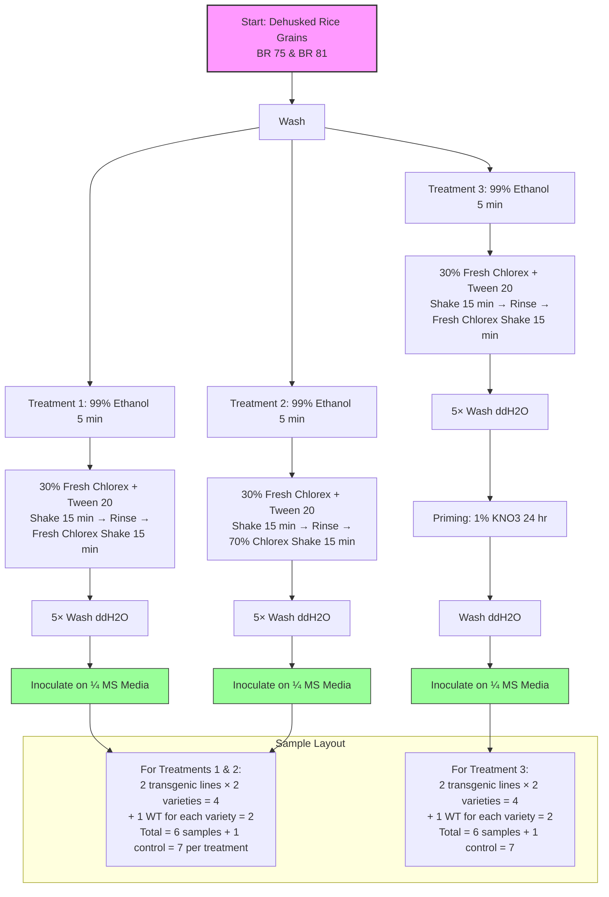

## Tools
1. 

## Papers
1. https://doi.org/10.3390/foods12040747
2. [youtube](https://www.google.com/search?q=rice+seed+sterilization+protocol&sca_esv=0dd423b6c7cf5c23&biw=1536&bih=738&sxsrf=APpeQnth6YbigozK9C_MKCRimeGSMrEuDw%3A1786001067924&ei=qzZ0arP-N7aYseMPr-zJ2A8&oq=rice+seed+steri&gs_lp=Egxnd3Mtd2l6LXNlcnAiD3JpY2Ugc2VlZCBzdGVyaSoCCAAyBhAAGBYYHjIGEAAYFhgeMgYQABgWGB4yCxAAGIAEGIoFGIYDMgsQABiABBiKBRiGA0jqnAFQqhtY54ABcAZ4AZABAJgBpwKgAecaqgEGMC4yMC4yuAEByAEA-AEBmAIXoAL9FKgCE8ICChAAGEcY1gQYsAPCAgQQIxgnwgINECMYogcYngYY8AUYJ8ICCxAAGIAEGIoFGJECwgIKEAAYgAQYigUYQ8ICEBAuGIAEGIoFGEMYxwEY0QPCAg0QIxjwBRieBhiiBxgnwgITEC4YgAQYigUYQxixAxjHARjRA8ICDRAAGIAEGIoFGEMYsQPCAgoQLhiABBiKBRhDwgIHECMY6gIYJ8ICDRAjGJ0GGOgGGOoCGCfCAhAQIxjwBRieBhiiBxjqAhgnwgINEC4YxwEY0QMY6gIYJ8ICFxAuGIAEGIoFGJECGOcGGOoCGLQC2AEBwgIXEAAYgAQYigUYkQIY5wYY6gIYtALYAQHCAhAQLhgDGI8BGOoCGLQC2AEBwgIQEAAYAxiPARjqAhi0AtgBAcICChAjGMkCGPAFGCfCAggQLhiABBixA8ICCBAAGIAEGLEDwgILEAAYgAQYigUYsQPCAgUQABiABMICCxAAGIAEGLEDGIMBwgIKECMY8AUYyQIYJ8ICEBAuGIAEGIoFGEMYsQMYyQPCAgoQLhhDGIAEGIoFwgIKEAAYgAQYFBiHAsICBxAAGIAEGA3CAgYQABgeGA3CAggQABgIGB4YDZgDBeIDBRIBMSBA8QUbtaK7hoXCWIgGAZAGCLoGBggBEAEYAZIHBDUuMTigB62zAbIHBDAuMTi4B-wUwgcGMC4yMC4zyAc2gAgB&sclient=gws-wiz-serp#fpstate=ive&vld=cid:d0844528-43a0-4e22-98eb-0833ec568fcd_f4fe11ae,vid:p0TFOnGyew0,st:10)

>[!info] **Summary:**

## Method

 i am germinating BR81 rice seeds. i am using various ways ... all seed were in 50C for dormancy break ..all seeds were divided into groups of 5 lines ..each line had 5 seeds.. 1)37C in water 2) dehusking --> washing--> innoculate in 1 4th MS media 3)in petridish using sugar free 1 4th MS media (no sucrose everything was same) 4) submerging the seed in 1% kno3 for 24 hr -->dehusking --> innoculate in media 5) dehusking-->washing-->primming with kno3 in 1% kno3 for 24 hr--> innoculate in 1 4th MS media

Results both 37c in water still not germinated (water is been changing regularly) sugerfree media has dried and did not germinated ...all of the seed in the 1 4th MS media has grown bacteria except 1 line ...

**2026-08-06**
i want to have this methods 
1. filter paper --> rice +water 
	1. 37c
	2. in sun light
2. filter paper-->rice + sugar free agar
	1. in 37c
	2. in room temperature
3. rice dehusking -->washing with 
				1. 99% ethanol for 30 sec
				2. 30% chlorex for 1 min
				3. ddH2O for 5 times (30sec each washing time)
					1. into the 1 4th MS media
					2. priming with 1% KNO3 -->washing and 
						1. into 1 4th MS media
						2. sugar free MS in a petridish 
							1. 37C in incubator
							2. room temparature
						3. filter paper 
							1. 37C incubator
							2. Sunlight

i have talked with my PI and she gave me 3 idea ...(this is the final)
 dehusk--> wash
		1. 99% ethanol for 5 mins-->30% fresh chlorex(has to be made fresh) + tween 20+ dehusked rice (for 30 mins in 2 steps --15mins shake and rinse the cholrex and again add cholorex and shake 15min-->5 times washing with ddH2O -->inoculate in the 1 4th MS media 
		2. 99% ethanol for 5 mins--> fresh chlorex(has to be made fresh) + tween 20+ dehusked rice (for 30 mins in 2 steps --15mins shake and rinse the cholrex(30% is used) and again add cholorex and shake 15min(70% cholrex is used)-->5 times washing with ddH2O -->inoculate in the 1 4th MS media 
		3. 99% ethanol for 5 mins-->30% fresh chlorex(has to be made fresh) + tween 20+ dehusked rice (for 30 mins in 2 steps --15mins shake and rinse the cholrex and again add cholorex and shake 15min-->5 times washing with ddH2O-->Primming with 1%KNO3 for 24hr-->wash with ddH2O -->inoculate in the 1 4th MS media 

**Both BR 75 & BR 81**

(2+2)x3 => 2 trans line for each BR75 and Br81 and 3 treatment 

media total 20--> for 1 and 2 (2 transgenic of 75 an 81 =2x2=4 ; 1 wt type for each )=((2+1)x2=6)x2=12 sample and 1 control media = 12 +1 =13
for 3 (2 transgenic of 75 an 81 =2x2=4 ; 1 wt type for each )=((2+1)x2= 6 sample and 1 control media = 6 +1 =7

## Log 
[[P001-E004_log_2026-08-06]]
